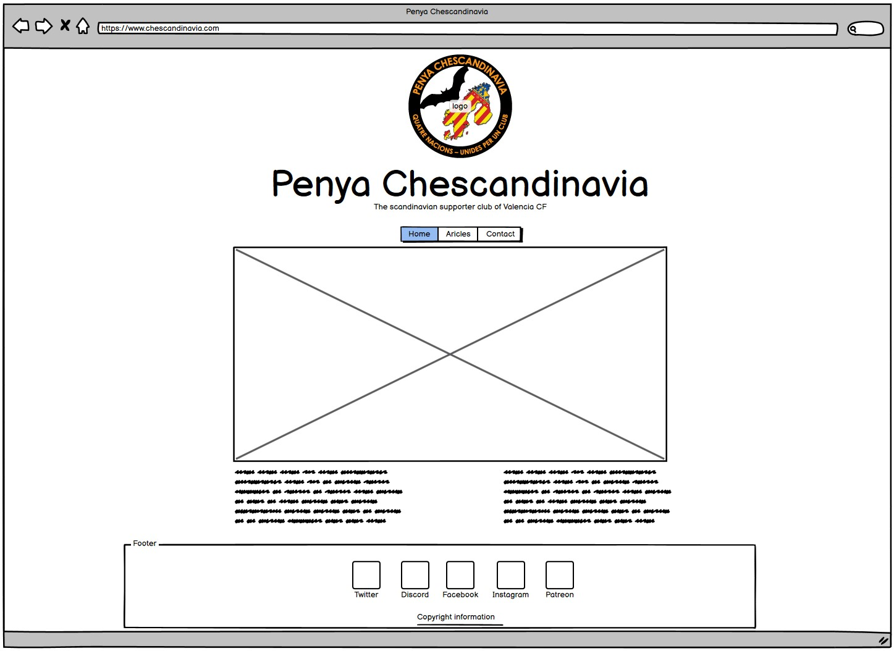
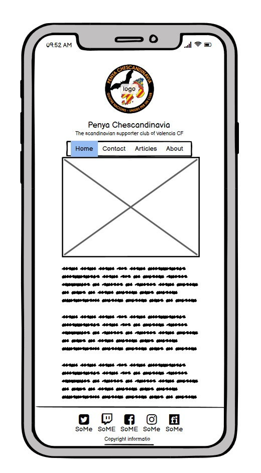
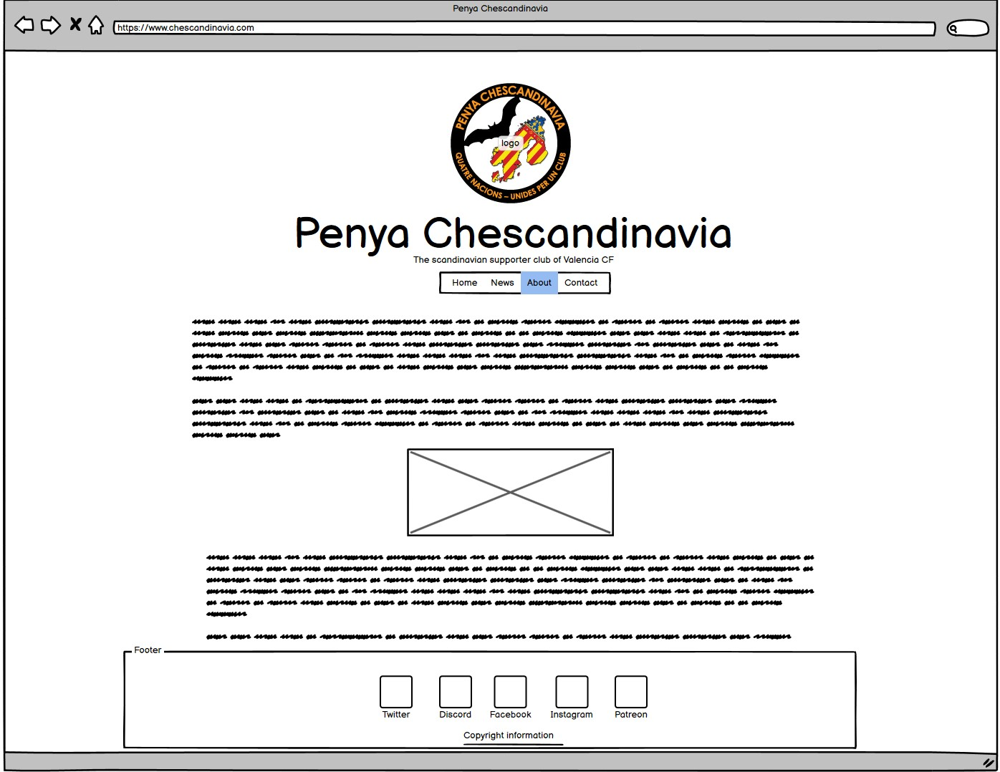
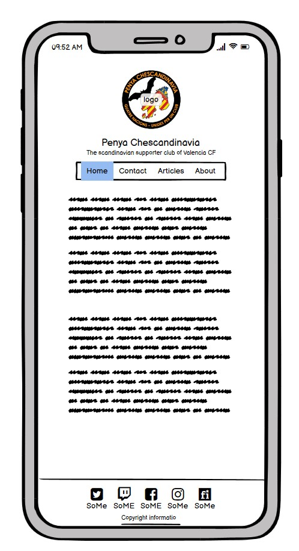
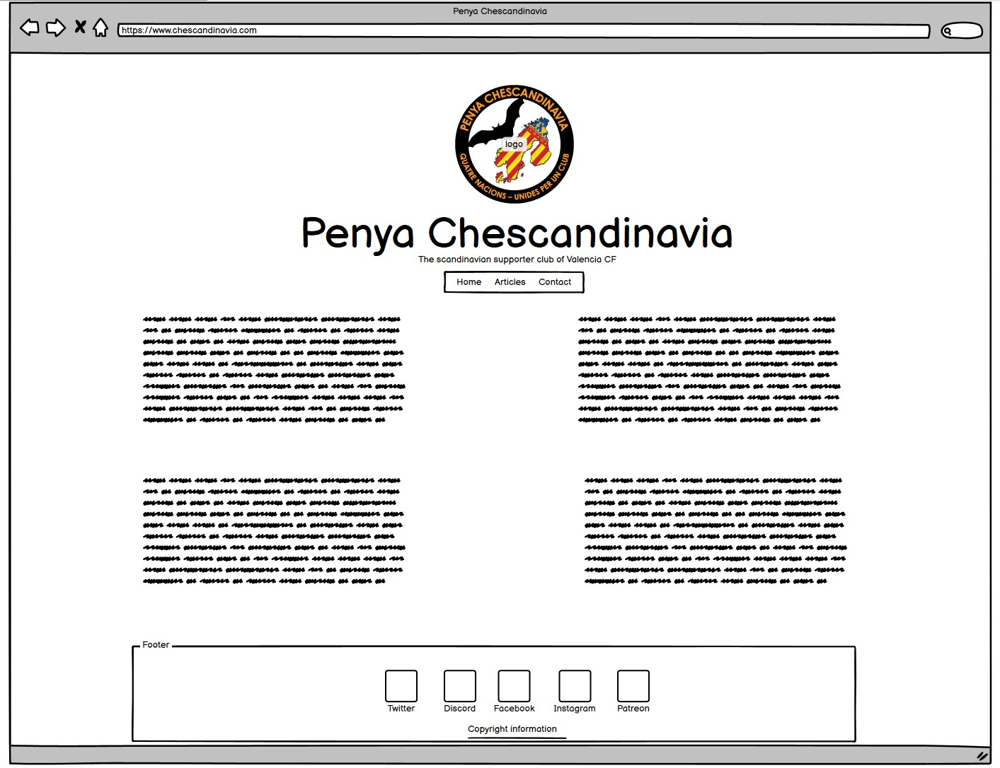
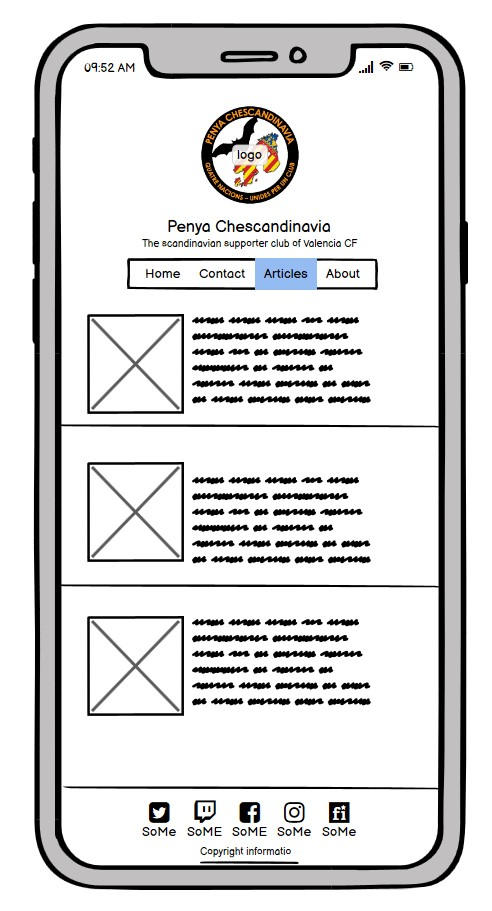
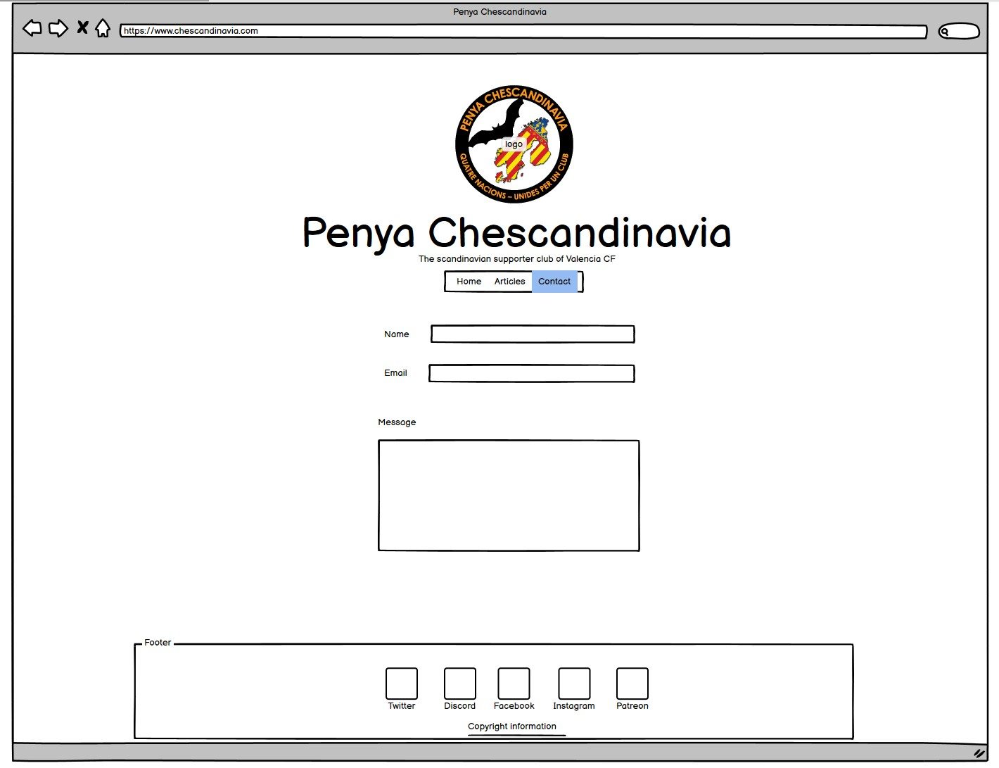
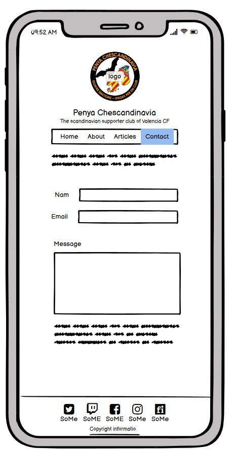

# Penya Chescandinavia - homepage
(Developer: Eirik Strøm Pedersen)

[Live webpage](https://eirikstrompedersen.github.io/Project-Portfolio-1-Penya-Chescandinavia/contact.html)

## Table of Contents

1. [Project Goals](#project-goals)
    1. [User Goals](#user-goals)
    2. [Site Owner Goals](#site-owner-goals)
2. [User Experience](#user-experience)
    1. [Target Audience](#target-audience)
    2. [User Requirements amd Expectations](#user-requirements-and-expectations)
    3. [User Stories](#user-stories)
3. [Design](#design)
    1. [Design Choices](#design-choices)
    2. [Color](#colors)
    3. [Fonts](#fonts)
    4. [Structure](#structure)
    5. [Wireframes](#wireframes)
4. [Technologies Used](#technologies-used)
    1. [Languages](#languages)
    2. [Frameworks & Tools](#frameworks-&-tools)
5. [Features](#features)
6. [Testing](#validation)
    1. [HTML Validation](#HTML-validation)
    2. [CSS Validation](#CSS-validation)
    3. [Accessibility](#accessibility)
    4. [Performance](#performance)
    5. [Device testing](#performing-tests-on-various-devices)
    6. [Browser compatibility](#browser-compatability)
    7. [Testing user stories](#testing-user-stories)
8. [Bugs](#Bugs)
9. [Deployment](#deployment)
10. [Credits](#credits)
11. [Acknowledgements](#acknowledgements)

## Project Goals

### User Goals
- Find the Scandinavian supporter organization for Valencia CF
- Get information about the supporter club
- Find events
- Link up with social media platforms

### Site Owner Goals
- Provide users with information about the suppoter club 
- Connect users to the social media platforms
- Inform users of our events
- Provide and store the history of Penya Chescandinavia

## User Experience

### Target Audience 
- Inhabitants in Scandinavia interested in Valencia CF
- People who wish to connect with the community

### User Requirements and Expectations
- Clean design with a color theme familiar to people who follows Valencia CF
- Easy to access information
- Links to social media platforms
- Responsive design
- Accessibility

### User Storiess

#### First-Time User
1. As a first time user, I want to get information about Penya Chescandinavia
2. As a first time user, I want to be able to connect with the social media platforms offered
3. As a first time user, I want to get information about upcoming events

#### Returning User
4. As a returning user, I want to learn more about the organization
5. As a returning user, I want to follow team news
6. As a returning user, I want to learn more about the supporter club

#### Site Owner
7. As the site owner, I want users to follow news and upcoming events
8. As the site owner, I want users to learn more about the organization
9. AS the site owner, I want users to be able to contact the organization 

## Design

### Design Choices
The website is designed with easy design, which make information easy to access for the user.

### Color
Colors is picked on the basis on familiarity to the football team and the region flag. The football team plays in white shirts, with black shorts. 
This is to give the user a sense of familiarity with the website.

### Fonts
Roboto is used for the logo as it is an elegant font. Merriweather used for the text content on the page, mainøy for it readability. Merienda One used in h2 to add some dynamic to the site.

### Structure
The page use a common design well know the for most users. With navigation bar at the top of the site and a footer at the bottom. In between the content are designed differently for every site.
The site cosist of 4 pages
- The homepage provide basic information about the supporter club and upcoming events
- The about page is a long read page with the history of the supporter club
- The news page consist of News notices. A quick read to get updated
- The contact page provides a form for the user. The "submit-button" will open the users mail client.

### Wireframes

Index - Desktop

Index - Mobile

About - Desktop

About - Mobile

News - Desktop

News - Mobile

Contact - Desktop

Contact - Mobile

## Technologies Used

### Languages
- HTML
- CSS

### Frameworks and Tools
- Git
- GitHub
- GitPod
- Fontawesome
- Balsamiq
- Google Fonts
- Favicon
- VS Code
- W3C Validator
- W3C CSS Validator
- Google Lighthouse
- Chrome DevTools

## Features

### Navigation bar and logo
- features on all pages, and is identical across  the pages. The navigation bar give the user access to navigate through all sites, and it's responsive. The logo is also a link that taks the user back to the landing page.
   

### Intoduction
- landing page image is the first the user sees when visitin the site. The image represent what Penya Chescandinavia is.

- introduction text feature on landing page. Gives the user basic information about the site and the organization.

### Events
- This section informs the user of upcoming events and gatherings.
- The section gives the user a overview of events in the different nations

### Footer
- Gives copyright information
- Provides the user with links to the different social media platform the organization uses
- Anchored to the bottom of the page

### News
- Section with News Notices, to provide a quick update for the user
- The section is devided in blocks for better overview

### About
- The section gives the user information about the organization and it's history
- This page also works as a safe space to save the history for the organization

### Form
- The form page gives the user access to contact the organization via mail
- The submit buttom opens the mail client on the user device

## Testing